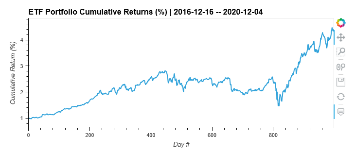

# The ETF Port-*all of my money into this*-folio Analyzer!

Welcome to the **07_Module_Challenge** Jupyter Notebook!

> The included Jupyter Notebook describes a workflow for the calculation of an ETF portfolio's *daily* and *cumulative* returns as well as visualize their movements throughout the period.

## Technologies

This Jupyter Lab Notebook has available to it the modules found in: 
> `requirements.txt`

## Installation Guide

The most straightforward method for interacting with the included materials is from within an **anaconda environment**. 
Instructions for installing anaconda may be found [here](https://www.anaconda.com/products/individual).

## Example

- A successful activation and proper rendering of the Jupyter Lab Notebook will appear similar to this screenshot:

## Usage

Once the necessary modules/libraries have been installed, launch the Jupyter Lab either via the command line or from within an IDE capable of opening the `.ipynb` file extension. From there, all steps performed, accompanying outputs, and analysis can be observed in sequence from top to bottom.

## Contributors

Forrest Surles

## License

MIT License

Copyright (c) 2021 Forrest Surles

Permission is hereby granted, free of charge, to any person obtaining a copy
of this software and associated documentation files (the "Software"), to deal
in the Software without restriction, including without limitation the rights
to use, copy, modify, merge, publish, distribute, sublicense, and/or sell
copies of the Software, and to permit persons to whom the Software is
furnished to do so, subject to the following conditions:

The above copyright notice and this permission notice shall be included in all
copies or substantial portions of the Software.

THE SOFTWARE IS PROVIDED "AS IS", WITHOUT WARRANTY OF ANY KIND, EXPRESS OR
IMPLIED, INCLUDING BUT NOT LIMITED TO THE WARRANTIES OF MERCHANTABILITY,
FITNESS FOR A PARTICULAR PURPOSE AND NONINFRINGEMENT. IN NO EVENT SHALL THE
AUTHORS OR COPYRIGHT HOLDERS BE LIABLE FOR ANY CLAIM, DAMAGES OR OTHER
LIABILITY, WHETHER IN AN ACTION OF CONTRACT, TORT OR OTHERWISE, ARISING FROM,
OUT OF OR IN CONNECTION WITH THE SOFTWARE OR THE USE OR OTHER DEALINGS IN THE
SOFTWARE.